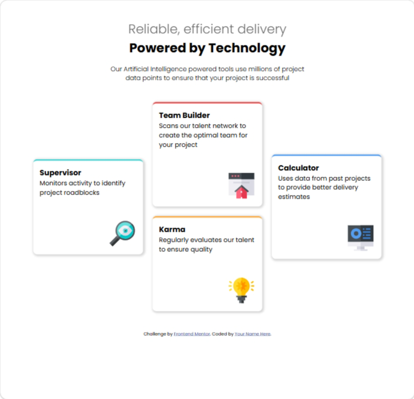
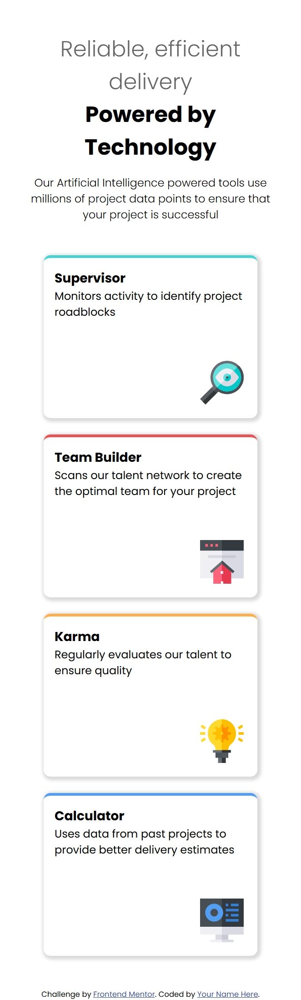

# Frontend Mentor - Four card feature section solution

This is a solution to the [Four card feature section challenge on Frontend Mentor](https://www.frontendmentor.io/challenges/four-card-feature-section-weK1eFYK). Frontend Mentor challenges help you improve your coding skills by building realistic projects. 

## Table of contents

- [Overview](#overview)
  - [The challenge](#the-challenge)
  - [Screenshot](#screenshot)
  - [Links](#links)
- [My process](#my-process)
  - [Built with](#built-with)
  - [What I learned](#what-i-learned)
  - [Continued development](#continued-development)
  - [AI Collaboration](#ai-collaboration)
- [Author](#author)
- [Acknowledgments](#acknowledgments)

## Overview

### The challenge

Users should be able to:

- View the optimal layout for the site depending on their device's screen size

### Screenshot





### Links

- Solution URL: [https://github.com/latefireqwerty/Responsive-Design-2-Four-card-feature-section](https://your-solution-url.com)
- Live Site URL: [https://latefireqwerty.github.io/Responsive-Design-2-Four-card-feature-section/](https://your-live-site-url.com)

## My process

### Built with

- Semantic HTML5 markup
- CSS custom properties
- Flexbox
- CSS Grid

### What I learned

I learned how to use Media Queries properly. As simple as it was (not easy), it feels exhilirating. Lmao, I'm so happy i could do this. Take that Responsive Design. I rock!!

```css
@media (max-width: 600px){
    header{
        width: 80%;
        font-size: 1rem;
    }

    .card{
        grid-template-columns: 1fr;
        margin: 0 auto;
    }

    .card__text--supervisor{
        grid-row: 1;
        grid-column: 1;
    }

    .card__text--team-builder{
        grid-row: 2;
        grid-column: 1;
    }

    .card__text--karma{
        grid-row: 3;
        grid-column: 1;
    }

    .card__text--calculator{
        grid-row: 4;
        grid-column: 1; 
    }
}
```

### Continued development

I need to practice more on Responsive Designs


### AI Collaboration

I used the AI in VSC just to help make sure if the code is correct or for any clarifications needed

## Author

- Frontend Mentor - [@latefireqwerty](https://www.frontendmentor.io/profile/latefireqwerty)


## Acknowledgments

Thanks to Kevin Powell's free course on conquering Responsive Design. Dude taught me a lot. Please join his course if you're struggling.
